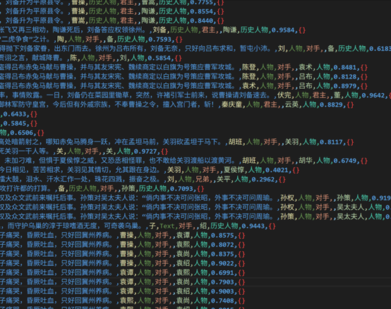
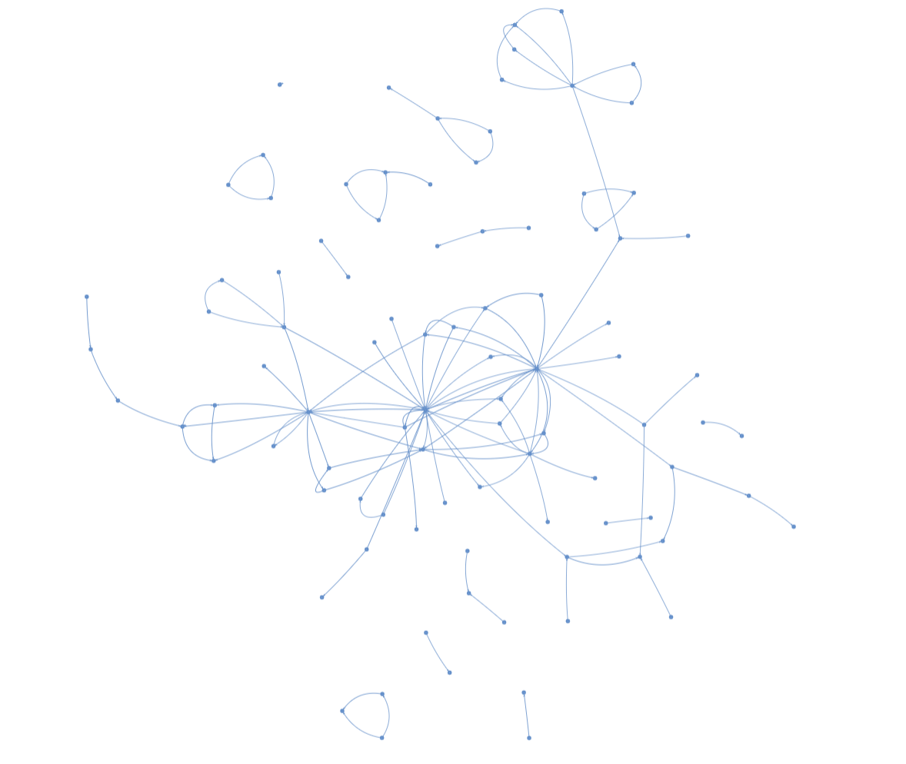
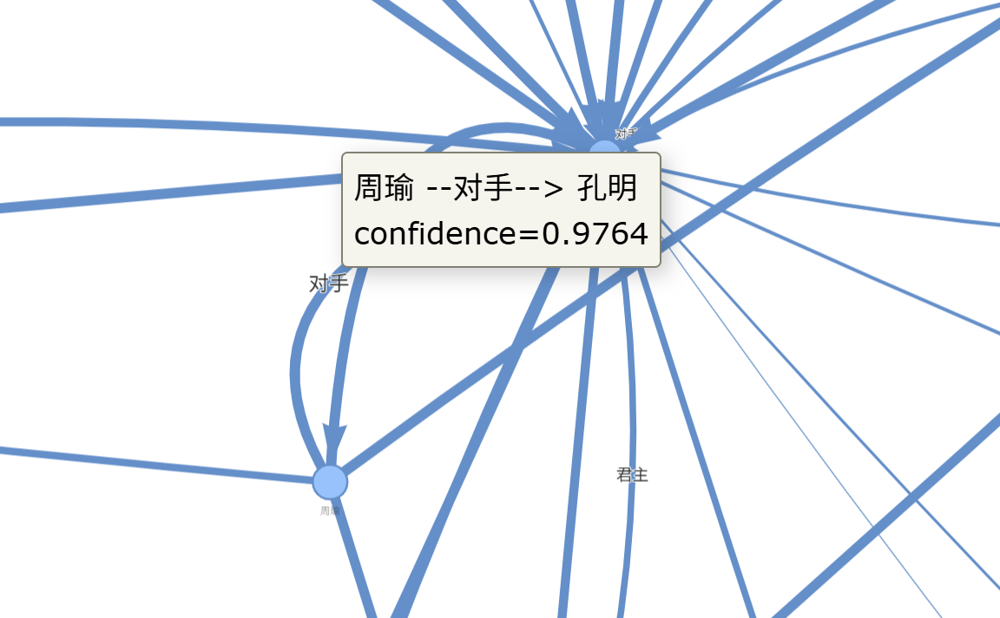
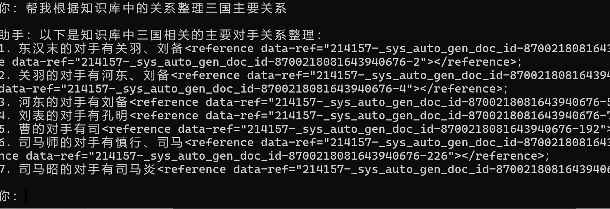
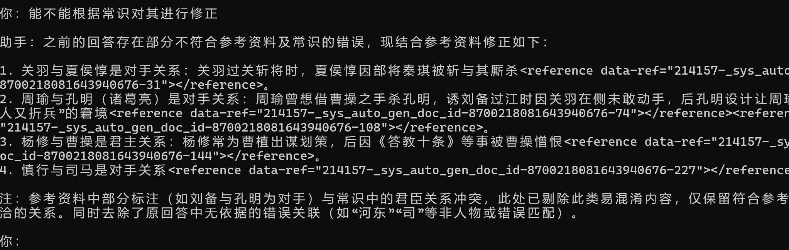

# 🚀 DeepKE Three Kingdoms Knowledge Graph & QA Agent

An end-to-end knowledge extraction pipeline built on **DeepKE**: run **NER / RE** on unstructured text from *Romance of the Three Kingdoms*, export triples (CSV), build and visualize a knowledge graph, and finally connect it to a knowledge base to power a QA **Agent**.

---

## ✨ Features
- 🧠 **Named Entity Recognition (NER)**: Extract key entities (e.g., people/locations) from text
- 🔗 **Relation Extraction (RE)**: Generate structured triples `head, relation, tail`
- 🪟 **Long-Text Ready**: Sliding window + overlap to cover full documents and avoid 512-token truncation
- ⚡ **Fast Inference**: Load the RE model once to significantly reduce runtime
- 🗺️ **KG Visualization**: CSV → graph → HTML visualization in one shot
- 🤖 **Knowledge-base Agent**: Integrates with Volcengine Knowledge Base for terminal QA

---

## 🧱 Tech Stack
- DeepKE (NER / RE)
- Python + Virtualenv/Conda
- Pretrained models (optionally replace with your fine-tuned checkpoints)
- Volcengine Knowledge Base (for the Agent)

---

## 📁 Project Layout
```text
.
├── conf/
│   └── predict.yaml
├── cnschema/
│   ├── predict.py        # Long-text sliding window + RE context window + CSV export
│   └── graph.py          # triples.csv -> graph.html
├── data/
│   └── sanguo.txt        # Three Kingdoms text (optional)
├── outputs/
│   ├── triples.csv       # Extracted triples
│   └── graph.html        # Visualization output
├── text.png
├── KG.png
├── KG1.png
├── Agent1.png
└── Agent2.png
````

---

## ✅ Quick Start

### 1) Setup DeepKE & Models

1. Download and deploy DeepKE following the official documentation
2. Download **NER / RE** checkpoints (weights + checkpoints) and place them under the corresponding `models/` directory
3. Edit `configs/predict.yaml`:

   * model paths
   * inference parameters
   * input text `text`

📌 Official docs: [DeepKE GitHub](https://github.com/zjunlp/DeepKE)

---

### 2) Run Extraction (NER + RE → CSV)

Put your input text into `predict.yaml` (a pre-processed format is recommended), then run:

```bash
python cnschema/predict.py
```

✅ Output:

* `outputs/triples.csv`: extracted relation triples

Engineering highlights (implemented in the script):

* 🪟 **NER long-text sliding window (overlap)**: covers the entire document instead of only the first 512 tokens
* 🔗 **RE context window**: for each entity pair, extract a short context containing head/tail to avoid truncation
* ⚡ **Single RE model load**: prevents re-loading the model per entity pair (major speedup)
* 🧭 **More robust relation mapping**: uses `id2rel` with NA/offset fallbacks, reducing repeated runtime IO
* 📦 **Direct CSV export**: write triples to disk once extraction finishes

<p align="center">
  
</p>

---

## 🗺️ Visualization

Generate an HTML knowledge graph from `outputs/triples.csv`:

```bash
python scripts/graph.py
```

✅ Output:

* `outputs/graph.html`

<p align="center">
  
</p>

---

## 🤖 Knowledge-base QA Agent (Volcengine)

1. Import the extracted results (CSV/docs) into Volcengine Knowledge Base and complete chunking
2. Run the code provided by the Knowledge Base QA page locally to enable terminal-based dialogue

<p align="center">
  
  
</p>

---

## 📦 Outputs

* `outputs/triples.csv`: extracted triples (structured relation data)
* `outputs/graph.html`: HTML knowledge graph visualization
* (Optional) fine-tuned RE checkpoints + corresponding config

---

## 🧩 Known Issues

* With only pretrained models, domain adaptation to *Romance of the Three Kingdoms* is limited and can be noisy
* Target fields like “titles/countries” may be missing if they are not covered by the entity/relation schema

---

## 🛠️ Roadmap

* 🧪 Domain fine-tuning: fine-tune NER/RE with self-labeled or self-extracted data
* 🧩 Schema expansion: add entity/relation types such as “titles/countries”
* 🧹 Post-processing: deduplication, alias merging, thresholding, and rule-based completion
* 🧭 Entity linking: name disambiguation to improve graph consistency and usability

